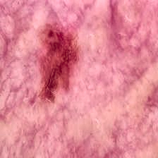
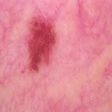
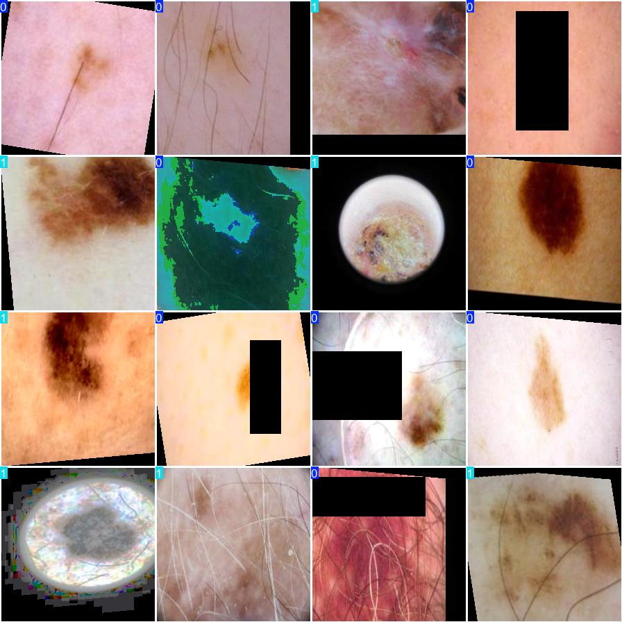
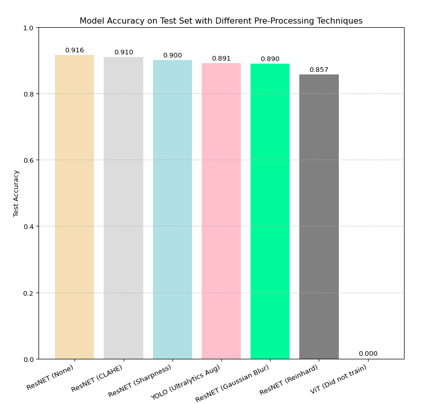
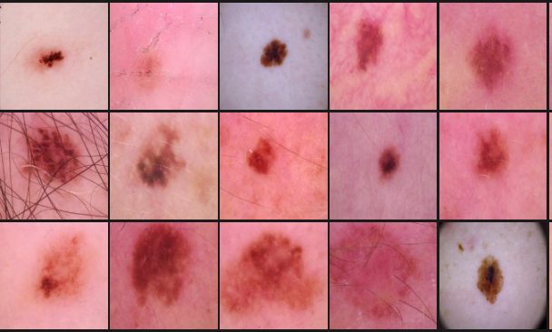

# tristar-takehome

## Motivation
There are couple different models I would like to try on this dataset, as well as different pre-processing techniques to increase signal strength.

### Models
1. YOLO - good for benchmarking because it's easy
2. ResNet - A commonly used medical imaging classifcation model
3. ViT - compare how vision transformers do on this task


## Image processing

#### Contrast Limited Adaptive Histogram Equalization (CLAHE) 
Usually best for greyscale images but I thought I would give it a try here. Good for this data as it regularly has regions that look uniform, but might hide important information. 

Normal Image/CLAHE Image

  


#### Guassian Blur

My intuition says that this would hurt the model, as its a blurring and we're looking for details here. I threw it in there anyways.

#### Image sharpening
Helpful for enhancing image features and useful to test here as it similar to CLAHE

Normal Image/Sharpness Image

#### Reinhard Color normalization
 
This could be really useful for improving the models performance on this dataset as its goal is to standardize colors across the samples in the dataset. Since there is quite a large variance in the skin tone, lighting,

  

## Approach

To establish baseline performance I trained a YOLO classification model. While the image augmentations and various hyperparameters used to train this model are not optimized, most of the augmentations in there beneficial. I left them all in to make things a bit easier.

Example of Yolo Augmentations

<p>
    
</p>

### Configuration

Docker is a pre-req to run this repository.
Because ultralytics is dependent on pytorch, we can just grab the ultralytics docker image from their registry and use it for training the yolo model, as well as training the ResNet and ViT models.

To download the docker image and run the container, execute the script below.
```bash
chmod +x start_docker
./start_docker
```

*You will need to setup the data folder like so inside this repo*
```
  data
    ├── testing
    │   └── test
    │       ├── Benign
    │       └── Malignant
    └── training
        ├── train
        │   ├── Benign
        │   └── Malignant
        └── val(made a 1k image validation split for Yolo training)
            ├── Benign
            └── Malignant

```

## Model Results

| Model | Model Accuracy on Test Set| Pre-Processing Applied|
| :---         | :---:    | ---:          |
| ResNET                | 0.916     |None    |
| ResNET                | 0.910     |CLAHE       |
| ResNET                | 0.900     |Sharpness    |
| YOLO                  | 0.891     |Standard UltralyticsAugmentations       |
| ResNET                | 0.890     |Guassian Blur     |
| ResNET                | 0.857     |Reinhard     |
| ViT                   | Did not train    |Did not train       |


*I was unable to train the ViT model on my local machine, as the GPU is not great and the training time on the CPU is a bit ridiculous*

Model Results Graphed

<p>
    
</p>


## Reflections & Areas of Improvement

### Error Analysis
Spending time on an error analysis is something I always do when training computer vision models, but was unable to do here due to time constraints. It's an invaluable asset to understanding the failure modes of the model as this information drives development of further model improvements.

### Sailency Map

A sailency map analysis would be a great way to learn more about what image features are having the largest influence on the models predictions. The results of this would really steer my next move as I would be able to make decisions about signal strength and noise.

### Improving signal/noise ratio
After looking at the data a little bit more, I realized that the most important signal is in the center of the image and most of the time does not take up the entire frame. This observation paired with the results of a sailency map test would likely provide valuable clues as to where to explore next. If the sailency map analysis showed that the model was struggling to find the signal, I would investigate cropping-in, or adding some sort of vignetting to strengthen the focus on center of the image. The reasoning behind doing this would be to increase the signal to noise ratio so that the classifier would have a better chance of picking up on the signal we care about. Below are some exmples.


**Most samples are in the center and don't take up the entire frame**




### Pre-Trained Models
All the models used here are pre-trained on standard datasets, so this is certainly an area in which I would investigate for further model improvments

### Model Training Duration
I tried to reduce the amount of time spent training models, and so I choose a semi-arbitray 10 epochs for the ResNet model and 20 for the yolo model. These models could have benefitted greatly from longer training


### Thanks! ヽ(ヅ)ノ